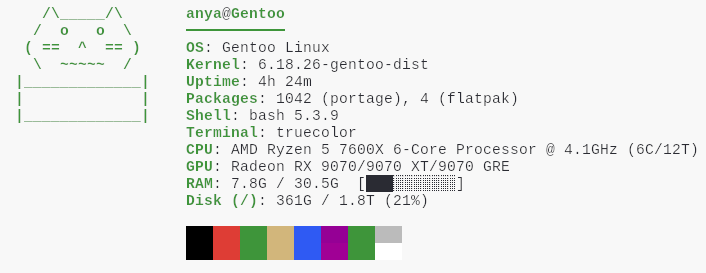

# meowfetch

Hi, this is an experimental project I have been working on with an agentic coding agent as a part of a module in one of my classes; this project is not a serious one, nor should it be taken seriously.

Meowfetch is a fetch utility with a pawesome twist! When ran it will display one of five cats, along side system information.



---
what it shows

- OS, kernel, uptime
- CPU (model, clock speed, core/thread count)
- GPU
- RAM and disk usage, with a progress bar
- shell, terminal, installed packages

---
requirements

- Python 3.10+

---
installation

## Linux / macOS

```bash
mkdir -p ~/.local/bin && curl -fLo ~/.local/bin/meowfetch https://codeberg.org/anyasretro/meowfetch/raw/branch/main/meowfetch.py && chmod +x ~/.local/bin/meowfetch
```

if `~/.local/bin` isn't in your PATH yet:

```bash
# zsh (macOS)
echo 'export PATH="$HOME/.local/bin:$PATH"' >> ~/.zshrc

# bash (Linux)
echo 'export PATH="$HOME/.local/bin:$PATH"' >> ~/.bashrc
```

## Windows (PowerShell)

```powershell
$bin = "$HOME\.local\bin"
New-Item -ItemType Directory -Force $bin | Out-Null
Invoke-WebRequest https://codeberg.org/anyasretro/meowfetch/raw/branch/main/meowfetch.py -OutFile "$bin\meowfetch.py" -ErrorAction Stop
'@echo off' + "`npython `"%~dp0meowfetch.py`" %*" | Set-Content "$bin\meowfetch.bat"
```

if `~\.local\bin` isn't in your PATH yet (run in PowerShell):

```powershell
[Environment]::SetEnvironmentVariable("Path", $env:Path + ";$HOME\.local\bin", "User")
```

then restart your terminal and run:

```bash
meowfetch
```

---
manual install

clone the repo and run the installer — it handles PATH detection automatically:

```bash
git clone https://codeberg.org/anyasretro/meowfetch
cd meowfetch
python3 meowfetch.py --install   # use 'python' on Windows
```
