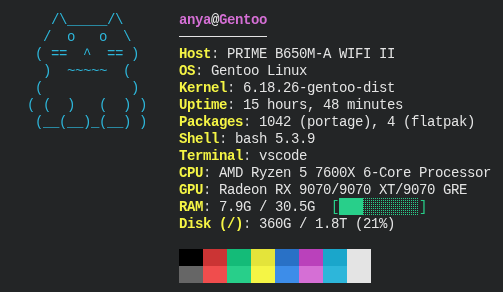

# meowfetch

Hi, this is an experimental project I have been working on with an agentic coding agent as a part of a module in one of my classes; this project is not a serious one, nor should it be taken seriously.

Meowfetch is a fetch utility with a pawesome twist! When ran it will display one of four cats, along side system information. 



---
what it shows

- OS, kernel, uptime
- CPU (model, clock speed, core/thread count)
- GPU
- RAM and disk usage with a little progress bar
- shell, terminal, installed packages
- a colour palette strip that matches your terminal theme

colours and accent are picked up automatically from your desktop environment (GNOME, KDE, or Xresources).

---
requirements

- Python 3.10+
- `psutil` — optional, but gives richer CPU/RAM/disk info. the install script will offer to add it for you.

---
installation

clone the repo and run the installer:

```bash
git clone https://codeberg.org/anyasretro/meowfetch
cd meowfetch
python3 meowfetch.py --install
```

that's it. the installer will:

- copy the script to `~/.local/bin/meowfetch`
- offer to install `psutil` via pip
- let you know if `~/.local/bin` needs to be added to your PATH

once installed, just run:

```bash
meowfetch
```

---
manual install

if you'd rather do it yourself:

```bash
pip install --user psutil
chmod +x meowfetch.py
cp meowfetch.py ~/.local/bin/meowfetch
```

make sure `~/.local/bin` is in your PATH:

```bash
echo 'export PATH="$HOME/.local/bin:$PATH"' >> ~/.bashrc
```
